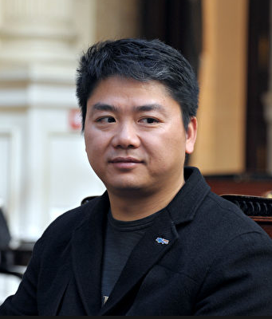

## 项目简介

​        我是**艾莉亚·史塔克**，看过《权游》的都会认识我，我们是一群无面者，我们没有掌握舆论的力量，但是我们拥有信息溯源还原真相的能力，这个权力游戏的世界我们时有时无，但是只要一听到我们的名字，不管某些人的外表强大或内在肮脏丑陋，都会闻风丧胆。**我们是无面者，我们是正义的化身！**

​        本项目需要大家的支持，**本项目是对刘强东强奸案，简称“刘强奸案”。利益各方的网络发言的信息溯源，深度挖掘强奸犯（如果真的强奸了）背后的强大利益集团，分析哪一些黑暗势力在颠倒黑白。**

## 人物介绍

​        刘强奸，或者叫刘京东，或者叫小强，强仔，强哥，强叔，强爷，原名刘强东，江苏宿迁人，京东集团董事长。好女色，富豪，权力游戏中的上层肮脏人物。

​        刘静尧，刘强奸案被害人。出于道义不挖掘其个人和家庭信息。

​        姚其湧，深圳宏兆企业集团老板，充当刘强奸嫖客的的中间介绍人。权利游戏中的“小指头”，乱世就是他的阶梯。介绍清纯女学生给刘强奸，从他的角度想也可以理解了。

​        **明尼苏达大学**，我们都知道中国土老板有点钱都会去大学镀金，刘强奸每学期付1000万美元给该学校得到“博士”学位，案发后，**学校本应拿出立场，却一直保持缄默。** 正义和利益面前，某些人往往站在利益至上，把正义束之高阁。从它的角度想，放弃一个女学生的权力，学校可以得到更多。整体是划算的，所以也可以理解了。

​        京东，美国上市公司。拥有几百家投资/控股子公司。价值近千亿市值。几十万中美股民。是一家被刘强奸胁迫着的利益集团，也是事件

## 项目贡献

​        本项目开源，力求去除互联网绑架，舆论绑架力量，做专业的刘强奸案**[信息溯源](docs\信息溯源.md)**，所有人都可以加入贡献一份力量。贡献方式：

1、右上角 fork 本项目。

2、对项目进行您认为的更改。

3、发起 pull requests 请求。

本项目将发布在：

## 刘强奸案该怎么判：

* 请参考我国“ [强奸罪量刑标准.md](docs\强奸罪量刑标准.md) ”

A、犯强奸罪，**处3年以上10年以下有期徒刑。**

B、犯强奸罪，扰乱公共安全罪，操纵舆论罪，泄露女生隐私，社会危害大影响恶劣，**处10年以上有期徒刑、无期徒刑或者死刑**。

C、刘强东属仙人跳，女大学生是骗子，两人嫖娼价格未谈妥导致，属于民事纠纷，**不追究老刘刑事责任**。

**如果有罪，我们无面者将在法律的框架下替天行道！**此判决将公开透明发布在网站，由广大网民投票产生，并公之于众。

## 其他资料：

